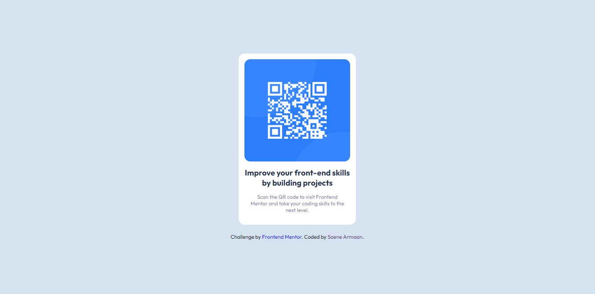

# Frontend Mentor - QR code component solution

This is a solution to the [QR code component challenge on Frontend Mentor](https://www.frontendmentor.io/challenges/qr-code-component-iux_sIO_H). Frontend Mentor challenges help you improve your coding skills by building realistic projects. 

## Table of contents

- [Overview](#overview)
  - [Screenshot](#screenshot)
  - [Links](#links)
  - [Built with](#built-with)
  - [Continued development](#continued-development)
- [Author](#author)

## Overview
I have made this web-page with tha help of Vanilla HTML and CSS. Nothing fancy was used to style this. I have used flex-box to layout my web-page.

### Screenshot

### Links

- Solution URL: [Add solution URL here](https://github.com/SaeneArmaan/qr-code-component-Vanilla-HTML-and-CSS)
- Live Site URL: [Add live site URL here](https://your-live-site-url.com)

### Built with

- Semantic HTML5 markup
- CSS custom properties
- Flexbox
- Desktop-first workflow

### Continued development

I would love to do more improvements in near future may be add some animations and use a CSS Framework once i have learned one.

## Author

- Frontend Mentor - [@SaeneArmaan](https://www.frontendmentor.io/profile/SaeneArmaan)